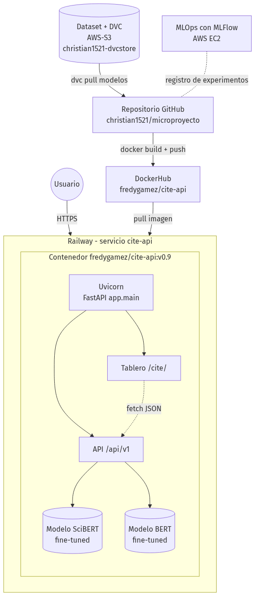
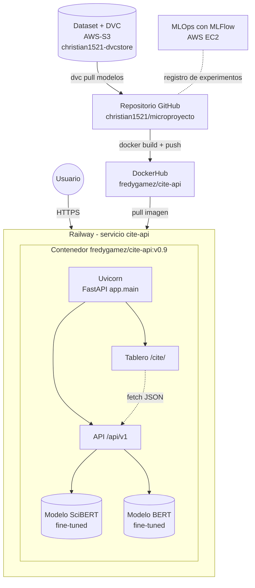
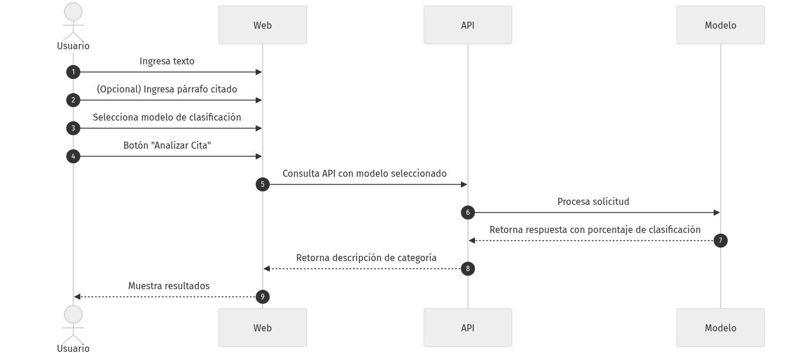
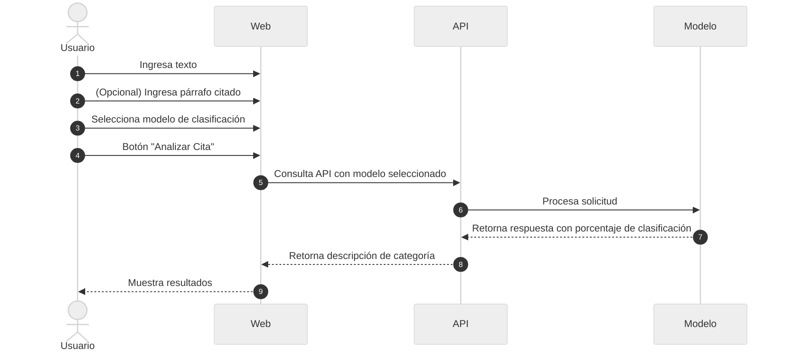

# Vista de desarrollo

## Estructura del repositorio

Repositorio: <https://github.com/christian1521/microproyecto>

```apl
https://github.com/christian1521/microproyecto
```

```
.
├── .dvc/config                    # Remoto DVC: s3://christian1521-dvcstore
├── app/                           # API + tablero (un solo servicio)
│   ├── main.py                    # FastAPI: página de inicio, router /api/v1, monta /cite
│   ├── api.py                     # Endpoints, catálogo de funciones, carga e inferencia de modelos
│   ├── config.py                  # Settings (/api/v1, CORS, logging)
│   ├── cite/                      # Tablero web
│   │   ├── index.html
│   │   └── favicon.svg
│   └── tests/                     # Pruebas pytest (conftest.py, test_api.py)
├── data/
│   ├── final_labelled_citing_sentences_all.csv.dvc # DVC dataset entrenamiento SCDF
│   ├── model_scibert_citing_sentences.dvc          # DVC del modelo SciBERT (~440 MB)
│   └── model_bert_citing_sentences.dvc             # DVC del modelo BERT (~439 MB)
├── experimentos-mlflow/           # Scripts de experimentos registrados en MLflow
│   ├── scibert_finetuning_v1.py … v4.py
│   ├── experimento_BERT.py
│   ├── experimento_MISTRAL.py
│   └── experimento_QWEN.py
├── dist/                          # Paquete distribuible (.whl, .tar.gz)
├── Dockerfile                     # Imagen única API + tablero (python:3.12)
├── .dockerignore
├── run.sh                         # Arranque Docker con uvicorn app.main:app ${PORT}
├── railway.json                   # Build/deploy en Railway (healthcheck, reintentos)
├── Procfile                       # Arranque estilo PaaS
├── pyproject.toml                 # Paquete citing-sentences-api
├── requirements.txt, test_requirements.txt, typing_requirements.txt
├── tox.ini, mypy.ini
└── README.md
```

## Diagrama de componentes





## Diagrama de secuencia del uso





## Stack tecnológico

| Capa | Tecnología |
| --- | --- |
| Lenguaje | Python 3.12 (imagen); ≥ 3.9 (paquete) |
| Modelos | Transformers ≥ 4.46, PyTorch ≥ 2.13 (CPU) |
| API | FastAPI ≥ 0.115, Uvicorn ≥ 0.32, Pydantic 2 |
| Tablero | HTML + CSS + JavaScript, servido con `StaticFiles` |
| Experimentos | MLflow en AWS EC2 (puerto 8050) |
| Versionado de datos | DVC + S3 |
| Contenedor / registro | Docker / DockerHub |
| Despliegue | Railway (PaaS) |
| Pruebas | pytest vía tox |

## Modelos servidos

| Modelo | Run en MLflow | F1 macro | Exactitud |
| --- | --- | --- | --- |
| SciBERT (`allenai/scibert_scivocab_uncased`) fine-tuned | `scibert-citfunc-seed42` | 0,883 | 0,907 |
| BERT fine-tuned | `bert-citfunc-seed42` | 0,828 | 0,862 |

Los modelos se cargan de forma diferida en la primera petición. La entrada se trunca a `MAX_LENGTH=128`
tokens. Si llega `cited_paragraphs`, el texto de entrada se arma así:
`"<citing_sentence> CONTEXT: In the text, the [CITATION] tag refers to: <cited_paragraphs>"`.

## Flujo de trabajo

1. Los datos y los modelos se versionan con DVC en S3, y el código se versiona en GitHub.
2. Los experimentos se registran en MLflow.
3. La imagen se construye localmente con los modelos en `data/` y se publica en DockerHub con *tags*
   `v0.x`.
4. Railway despliega el *tag* elegido.

[Volver al inicio](index.md)
