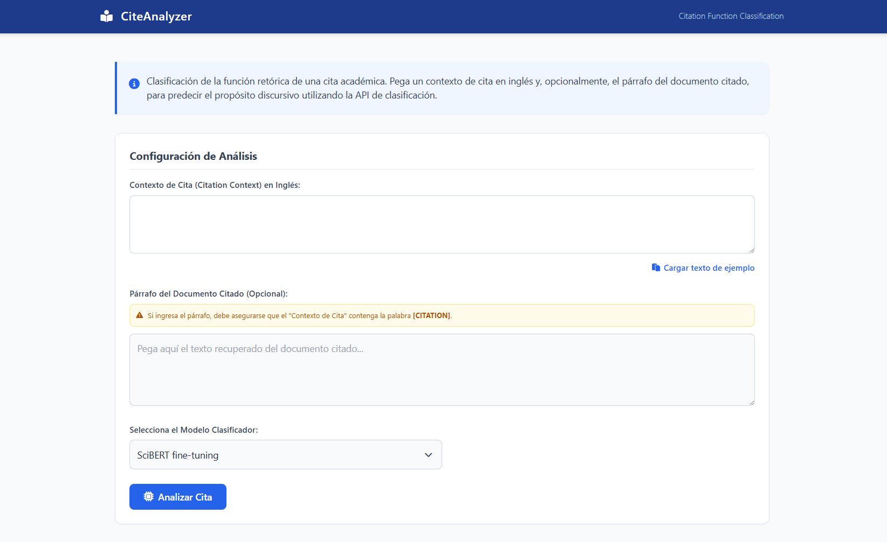
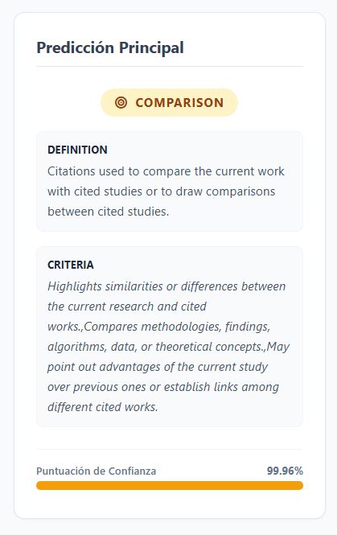
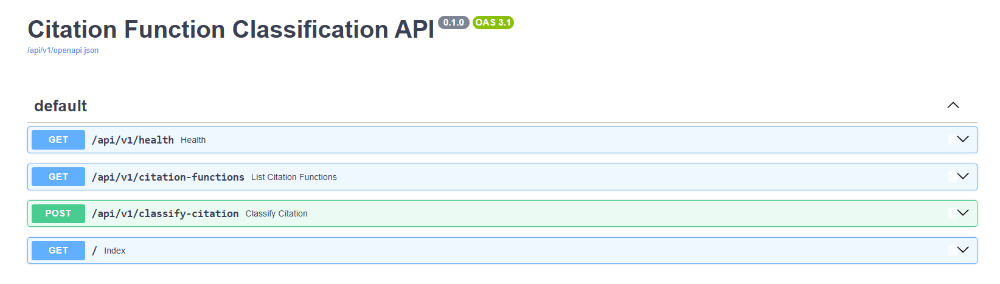

# Manual de usuario del tablero

**Este manual está dirigido** a quien redacta un artículo o una tesis en inglés y quiere comprobar si una cita transmite la intención que busca. No hace falta saber programar ni crear una cuenta.

## 1. Abrir el tablero

Hay varias formas de ingresar:

- Directamente: <https://cite-api-production.up.railway.app/cite/>
- Desde la página de inicio <https://cite-api-production.up.railway.app/>, con el botón **Abrir Tablero (Aplicación)**. El botón **Abrir Documentación del API** abre Swagger.


## 2. Ingresar los datos



| Campo | Obligatorio | Descripción |
| --- | --- | --- |
| **Contexto de Cita** | Sí | La frase o el párrafo que contiene la referencia, en inglés. |
| **Párrafo del Documento Citado** | No | El párrafo del artículo citado al que remite la referencia. Da más contexto al modelo. |

Ejemplo de contexto de cita:

```
Similar to the method proposed in [CITATION], we adopt a transformer-based architecture.
```

> [!IMPORTANT]
> Si llena el **Párrafo del Documento Citado**, el **Contexto de Cita** tiene que incluir el marcador `[CITATION]` justo donde va la referencia. Sin el marcador, el API responde con error 400 y no hace el análisis.

Se recomienda escribir la oración completa. El modelo se entrenó con oraciones de unas 34 palabras (mediana), y una frase cortada pierde pistas que ayudan a identificar la función.

## 3. Seleccionar el modelo

En **Selecciona el Modelo Clasificador** se escoge el modelo:

| Opción | Modelo | F1 macro (MLflow) |
| --- | --- | --- |
| BERT fine-tuning (por defecto) | `bert-citfunc-seed42` | 0,828 |
| SciBERT fine-tuning | `scibert-citfunc-seed42` | 0,883 |

Puede analizar la misma cita con los dos modelos y comparar los resultados.

## 4. Analizar

Pulse **Analizar Cita**. La primera consulta después de que arranca el servicio tarda unos segundos más, porque el modelo se carga en memoria en ese momento. Las consultas siguientes responden casi al instante.

## 5. Interpretar el resultado

Los resultados aparecen en dos paneles.

**Panel izquierdo - Predicción principal:** la función más probable, con su definición, su criterio y la **puntuación de confianza**.



**Panel derecho - Distribución de probabilidades:** las 9 funciones ordenadas de mayor a menor probabilidad. Al hacer clic en el nombre de cualquier función se abre su definición y su criterio. Así puede compararla con la función ganadora.


### Cómo leer la confianza

- **Confianza alta (> 0,80) y lejos de la segunda categoría:** la cita comunica su intención con claridad.
- **Confianza media (0,40-0,70) con una segunda categoría cercana:** la redacción es ambigua. Revisar las dos definiciones y reformule la frase.
- **La categoría ganadora no es la que usted buscaba:** el lector puede entender la cita de otra manera. Este es el caso de uso principal de la herramienta.

## 6. Uso directo del API (opcional)

En <https://cite-api-production.up.railway.app/docs> puede probar los servicios con **Try it out**:

| Método | Ruta | Uso |
| --- | --- | --- |
| GET | `/api/v1/health` | Estado del servicio y del modelo |
| GET | `/api/v1/citation-functions` | Catálogo de las 9 funciones (acepta `function_name`) |
| POST | `/api/v1/classify-citation` | Clasificación de una cita |



```json
{
  "citing_sentence": "Similar to the method proposed in [CITATION], we adopt a transformer-based architecture.",
  "type_model": "scibert",
  "cited_paragraphs": ""
}
```

`type_model` acepta `scibert` o `bert`.

[Volver al inicio](index.md)
